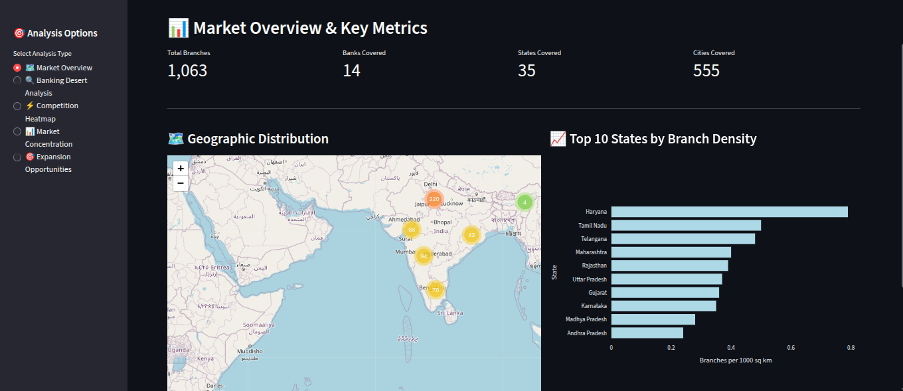
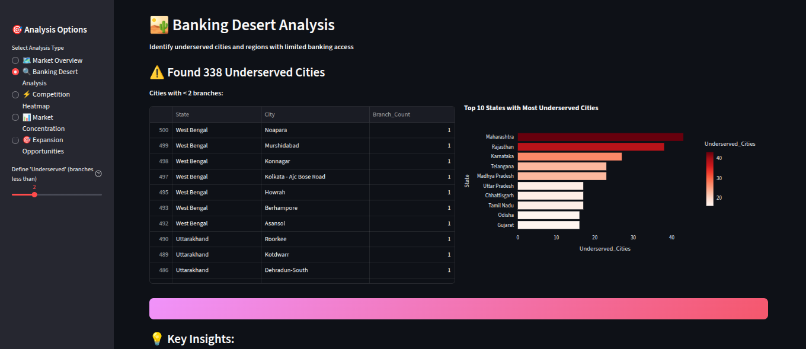
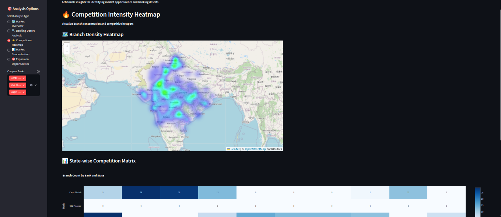
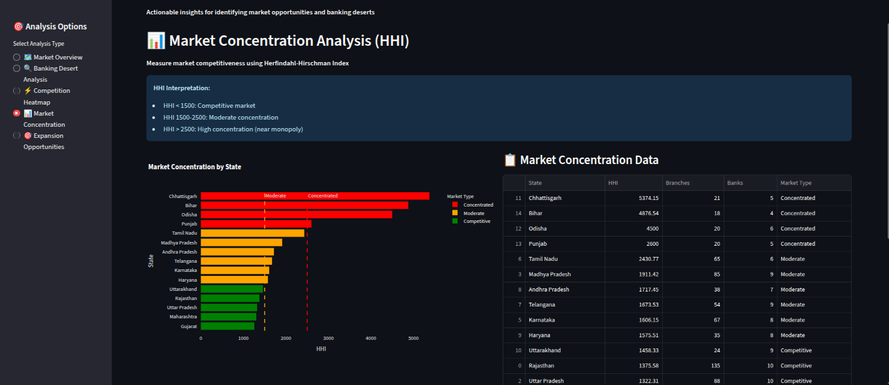
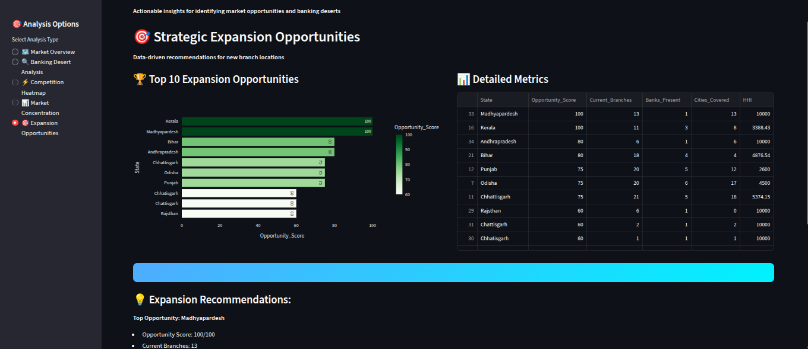

# Indian Bank Branch Analytics Dashboard

<div align="center">

**Actionable insights for banking expansion, competition analysis, and identifying underserved markets**

[](https://python.org)
[](https://streamlit.io)
[](https://plotly.com)
[](https://python-visualization.github.io/folium/)
[](https://opensource.org/licenses/MIT)
[](https://github.com/psf/black)

</div>

---

## Problem Statement

Traditional bank branch data visualization only shows **what** - maps, counts, and pie charts. This dashboard answers **why**, **where**, and **how** to make data-driven business decisions:

- Where are the banking deserts? (underserved cities)
- Where should we expand next? (opportunity scoring)
- Where is competition weakest? (market concentration analysis)
- Which markets are oversaturated? (density heatmaps)

---

## Features & Analytics

### 1. Market Overview
Comprehensive view of branch distribution with **density** metrics (not just counts)



**Key Insights:**
- Branch density per 1000 sq km (accounts for state size)
- Color-coded markers by bank
- Clustered visualization for performance

---

### 2. Banking Desert Analysis
Identify **338 underserved cities** with limited banking access



**Business Value:**
- Find greenfield expansion opportunities
- Target underbanked populations
- First-mover advantage in emerging markets

---

### 3. Competition Intensity Heatmap
Visualize branch concentration and identify competitive hotspots



**Use Cases:**
- Spot overbanked vs underbanked regions
- Compare bank-by-bank presence across states
- Identify white spaces for expansion

---

### 4. Market Concentration Analysis (HHI)
Measure market competitiveness using the **Herfindahl-Hirschman Index**



**Strategic Insights:**
- **HHI < 1500**: Competitive markets (harder to enter)
- **HHI 1500-2500**: Moderate concentration
- **HHI > 2500**: High concentration (monopolistic - easier to compete)

---

### 5. Expansion Opportunity Scoring
Data-driven recommendations for new branch locations



**Scoring Algorithm Considers:**
- Current branch density
- Number of competing banks
- Cities available for expansion
- Market concentration (HHI)

**Result:** Top 10 states ranked by opportunity score (0-100)

---

## Quick Start

### Prerequisites
```bash
Python 3.8+
pip
```

### Installation

1. **Clone the repository**
   ```bash
   git clone https://github.com/rajdeepk012/indian-bank-branch-analytics.git
   cd indian-bank-branch-analytics
   ```

2. **Install dependencies**
   ```bash
   pip install -r requirements.txt
   ```

3. **Run the dashboard**
   ```bash
   streamlit run dashboard/app.py
   ```

4. **Open in browser**
   ```
   http://localhost:8501
   ```

---

## Project Structure

```
indian-bank-branch-analytics/
├── dashboard/
│   ├── app.py                    # Main Streamlit application
│   └── components/               # (Future) Modular components
├── data/
│   ├── sample/                   # Sample data (1,063 branches)
│   │   ├── combined_banks_sample.csv
│   │   ├── federal_bank_sample.csv
│   │   ├── cholamandalam_sample.csv
│   │   └── ... (19 more banks)
│   ├── processed/                # (Future) Aggregated data
│   └── data_loader.py            # Data loading utilities
├── analysis/
│   ├── notebooks/                # Jupyter notebooks
│   └── scripts/                  # Analysis scripts
├── assets/                       # Screenshots & images
│   ├── market_overview.png
│   ├── banking_desert.png
│   ├── competition_heatmap.png
│   ├── market_concentration.png
│   └── expansion_opportunities.png
├── requirements.txt              # Python dependencies
├── LICENSE                       # MIT License
└── README.md                     # This file
```

---

## Dataset

### Coverage
- **19 Financial Institutions**: Mix of banks, NBFCs, and housing finance companies
- **1,063 Branches**: With complete geocoded data (lat/long)
- **35 States & UTs**: Pan-India coverage
- **555 Cities**: Urban and semi-urban centers

### Institutions Included
| Type | Examples |
|------|----------|
| **Banks** | IndusInd Bank, Federal Bank, Sewa Bank |
| **NBFCs** | Cholamandalam, TVS Credit, Protium |
| **Housing Finance** | ICICI HFC, Aadhar Housing, Capri Global, SMFG Grihashakti |
| **Small Finance Banks** | Jana Bank, Satya Microhousing |

### Data Schema
```csv
Bank, State, City, Branch, Address, Pincode, Latitude, Longitude
```

---

## Technologies Used

### Core Stack
- **[Streamlit](https://streamlit.io)** - Interactive dashboard framework
- **[Pandas](https://pandas.pydata.org)** - Data manipulation
- **[Plotly](https://plotly.com)** - Interactive charts
- **[Folium](https://python-visualization.github.io/folium/)** - Geographic maps
- **[SciPy](https://scipy.org)** - Statistical analysis

### Visualization
- **Heatmaps** - Branch density visualization
- **Marker Clustering** - Performance optimization for large datasets
- **Color-coded Maps** - Bank-wise differentiation
- **Interactive Charts** - Bar charts, pie charts with drill-down

### Analytics
- **HHI Calculation** - Market concentration index
- **Density Analysis** - Branches per 1000 sq km
- **Opportunity Scoring** - Multi-factor ranking algorithm

---

## Use Cases

### For Banks & Financial Institutions
1. **Expansion Planning**: Identify high-opportunity, low-competition markets
2. **Competitive Intelligence**: Track competitor presence state-by-state
3. **Market Entry Strategy**: Find banking deserts for first-mover advantage

### For Investors & Analysts
1. **Market Analysis**: Assess banking sector concentration
2. **Competition Research**: Compare bank footprints
3. **Investment Decisions**: Identify underbanked regions for fintech opportunities

### For Policymakers
1. **Financial Inclusion**: Identify underserved regions
2. **Rural Banking Gaps**: Target areas for intervention
3. **Banking Accessibility**: Measure geographic coverage

---

## Key Insights from Data

### Banking Deserts
- **338 cities** have less than 2 branches
- **Maharashtra** has the most underserved cities (40+)
- **West Bengal** shows highest concentration of single-branch cities

### Market Concentration
- **Chhattisgarh** has highest HHI (5374) - near monopoly
- **Rajasthan** is most competitive (HHI: 1375)
- **14 states** show high concentration (HHI > 2500)

### Expansion Opportunities
- **Madhya Pradesh** scores highest (100/100) for expansion
- **Kerala** offers good density with moderate competition
- **Odisha** shows balanced opportunity (75/100 score)

---

## Advanced Features

### Performance Optimizations
- **Caching**: `@st.cache_resource` and `@st.cache_data` for fast reloads
- **Sampling**: Displays max 500 markers on maps for performance
- **Marker Clustering**: Groups nearby branches automatically

### Data Quality
- **Coordinate Validation**: Filters lat/long to India bounds (6-37°N, 68-97°E)
- **Duplicate Handling**: Removes invalid/duplicate records
- **Type Conversion**: Robust parsing of mixed data types

---

## Future Enhancements

- Add all 93 banks (currently 19 banks with coordinates)
- Population density overlay for better opportunity scoring
- Time-series analysis (track expansion over time)
- Machine learning for expansion prediction
- Export reports as PDF
- API for programmatic access
- Real-time data updates via web scraping
- Urban vs Rural classification
- Distance-to-nearest-branch calculator

---

## Contributing

Contributions are welcome! Please feel free to submit a Pull Request.

1. Fork the project
2. Create your feature branch (`git checkout -b feature/AmazingFeature`)
3. Commit your changes (`git commit -m 'Add some AmazingFeature'`)
4. Push to the branch (`git push origin feature/AmazingFeature`)
5. Open a Pull Request

---

## License

This project is licensed under the MIT License - see the [LICENSE](LICENSE) file for details.

---

## Acknowledgments

- **Data Source**: Web scraped from official bank websites (19 institutions)
- **Inspiration**: Financial inclusion research and banking accessibility studies
- **Tools**: Built with amazing open-source libraries (Streamlit, Plotly, Folium)

---

## Contact

**Rajdeep Kuntal**

Project Link: [https://github.com/rajdeepk012/indian-bank-branch-analytics](https://github.com/YOUR_USERNAME/indian-bank-branch-analytics)

---

<div align="center">

**Star this repo if you found it helpful!**

Made with dedication for better banking accessibility in India

</div>
